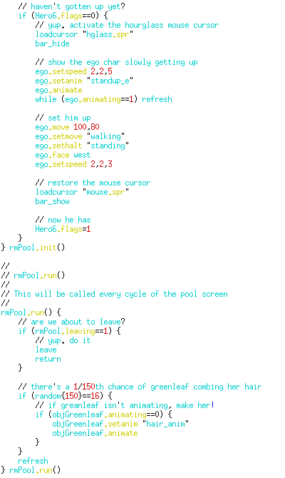

# MAD

The MAD project was an effort to create a script language plus interpreter, intended for the creation of adventure games. It is heavily influenced by Sierra's Creative Interpreter (SCI), which was the driving force of the famous King's Quest and Quest for Glory series of games.

More information can be found in the [readme.txt](readme.txt) file included in the Git repository.

## Versions

There are two versions of MAD available: MADv2, which was used for the Hero6 dialogue demo and the initial Query for Glory 1 remake to showcase the technology, and MADv4 which was used for the pool demo. The latter version supports 32 bit color images and has a far more advanced script engine.

## Rewrite

This is my longest-running project of all time, having actively developed it for more than 4 years. The project has been taken over by Nunzio Hayslip and Javier Gonzales, who have rewritten most of the code and switched to the [Lua programming language](https://www.lua.org). My involvement in this effort has been very limited, but the complete project is available at [SourceForge](http://mad-project.sourceforge.net).

## Hero6

MAD has also been used in the [Hero6 project](http:/www.hero6.com), where it was used for the first two demos. After I left the project, Hero6 has switched to a different system (I am unaware of any specifics)

## MADv2 screenshots

Quest for Glory 1 remake in MAD

Example script

## MADv4 screenshots

Hero6 pool demo

Integrated debugger

Hero6 pool demo script

Unreleased Hero6 content

Showcasing the animation debugging

## Downloads

The release presented here consists of the old versions of MAD, which contain a homebrew programming language and VM instead of Lua. All utilities are included, as well as demo projects. There is also a patch included which fixes the MADv4 utilities so that they work on recent systems (there were some double frees, reliance on nonstandard `strcpy()` behaviour and off-by-one's in the old codebase).

  * [Final release](releases/mad-20081005.tar.bz2), 2008-10-05 (2MB)
  * [Patch needed to compile on modern systems](releases/mad-20110821.diff), 2011-08-21 (4KB)
